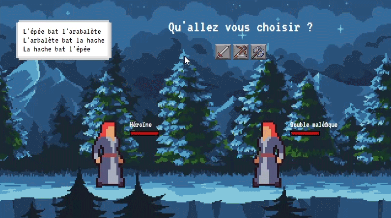

# Pierre Feuille Ciseau

[Demo](https://web-lux.github.io/pierre-feuille-ciseau/)

## 📄 Description
Un jeu de Pierre Feuille Ciseau réalisé dans le cadre de l'[Odin Project](https://www.theodinproject.com/lessons/foundations-rock-paper-scissors#assignment) afin de pratiquer les bases du javascript vanilla. J'ai fait le choix d'une UI inspirée des jeux vidéos sidescroller et remplacé le "Pierre Feuille Ciseau" traditionnel par un "Épée Hache Arbalète" en référence à la licence Fire Emblem.

## 🔨 Outils utilisés
- HTML
- CSS
- Javascript

## 🧱Crédits
- Forêt en fond : https://uppon-hill.itch.io/indie-tales-parallax
- Sprite de l'héroïne et de son double maléfique : https://craftpix.net/freebies/free-villagers-sprite-sheets-pixel-art/?num=1&count=2&sq=villagers&pos=0
- Icons des armes : https://cheekyinkling.itch.io/shikashis-fantasy-icons-pack?download
